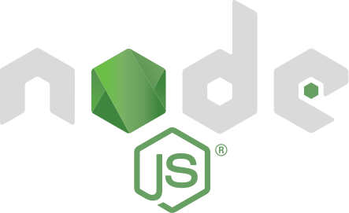

Week 0 - Starting Line :dash:
=============================
 > On your marks, get set, go!

These are the development programs we will be using throughout the course! Click
any you may have lost.

In addition to these services, Windows users need to download [Git][1]. During
installation, select "Use Git from the Windows Command Prompt" when prompted,
and leave all other installation settings as their defaults.

[1]: https://git-scm.com